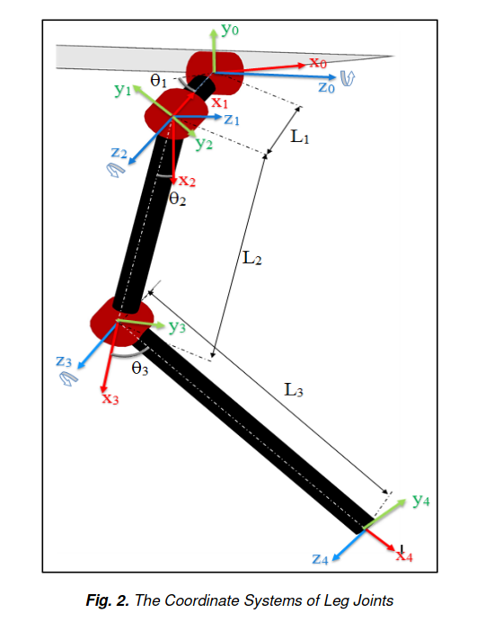

# OATPP Doggy Dance Project

This is a repo that uses [oatpp](https://oatpp.io/) to serve up an api for the doggy dance project that will calculate kinematics for the supported robot models.  

Install Eigen. Clone repo, checkout 3.4.0, checkinstall it or whatnot.

```
mkdir build
cd build
cmake ..
make
```

Usage

Run the server

```
./doggy-dance-project.exe
```

Call the API

```
mz@mz-VirtualBox:~$ curl 0.0.0.0:8000/robomodels
{"descriptions":[{"id":0,"name":"Robot Dog"}]}
```

## Coordinate System of the Legs

To get from the coordinate system of the main body to the legs:
rotate in Y and translate in X and Z.

For the left side, they rotate by -pi/2 in y.

so if before we are:

```
    y   x
     \  |
      \ |
       \----z---
```

we rotate by Y by neg pi/2. positive rotation is clockwise when looking from origin out. so we rotate counterclockwise 90 degrees.

```
     ------x--
    /|
   / |
  y  z
 /   |
```

then we translate. for back left, we translate z by -w/2, and we translate x by -l/2.

so that would be somewhere here:

```
x

         ------x--
        /|
       / |
      y  z
     /   |
```

## Forward Kinematics using Denavit-Hartenberg Parameters

Two variables for rotation are theta and alpha.  
Two variables for displacement are r and d.  

Theta: angle from Xn-1 to X n around Z n -1.  
alpha: angle from zn-1 to zn around x n.

r (sometimes see a letter instead of r): distance between origin of n-1 frame and origin of n frame along xn direction.  
d distance from Xn-1 to Xn along Z n -1 direction.  

We lay out the robot system, and we do this following rules. Namely:  

* z-axis is in direction of joint axis
* x-axis is parallel to the common normal (line perpinddicular to both joints), or free if no unique common normal
* the y-axis follows from x and z axis by choosing it to be right handed coordinate system.

Joint positioning as per Muhammed Arif Sen, Veli Bakircioglu, Mete Kalyoncu in https://www.ijstr.org/final-print/sep2017/Inverse-Kinematic-Analysis-Of-A-Quadruped-Robot.pdf.  


| joint i  | theta i (degree)  | alpha i (degree)  |  r i (meters) |  d i (meters) |
|---|---|---|---|---|
|  0-1 | theta1   |  0 |  l1 | 0  |
|  1-2 | -pi/2  | -pi/2  |  0 |  0 |
| 2-3  | theta2  | 0  |  l2 |  0 |
| 3-4  |  theta3 |  0 |  l3 | 0  |

Then, as per wikipedia we can make the matrices so:  


If we write each matrix out, we can do multiplication to go from 0 to 4, the end effector.  

