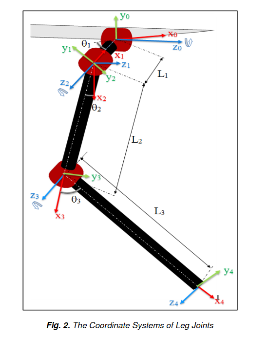
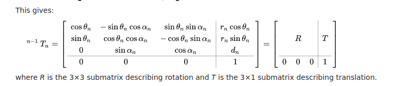

# OATPP Doggy Dance Project

This is a repo that uses [oatpp](https://oatpp.io/) to serve up an api for the doggy dance project that will calculate kinematics for the supported robot models.  

Install Eigen. Clone repo, checkout 3.4.0, checkinstall it or whatnot.

```
mkdir build
cd build
cmake ..
make
```

Usage

Run the server

```
./doggy-dance-project.exe
```

Call the API

```
mz@mz-VirtualBox:~$ curl 0.0.0.0:8000/robomodels
{"descriptions":[{"id":0,"name":"Robot Dog"}]}
```

## Coordinate System of the Legs

To get from the coordinate system of the main body to the legs:
rotate in Y and translate in X and Z.

For the left side, they rotate by -pi/2 in y.

so if before we are:

```
    y   x
     \  |
      \ |
       \----z---
```

we rotate by Y by neg pi/2. positive rotation is clockwise when looking from origin out. so we rotate counterclockwise 90 degrees.

```
     ------x--
    /|
   / |
  y  z
 /   |
```

then we translate. for back left, we translate z by -w/2, and we translate x by -l/2.

so that would be somewhere here:

```
x

         ------x--
        /|
       / |
      y  z
     /   |
```

## Forward Kinematics using Denavit-Hartenberg Parameters

Two variables for rotation are theta and alpha.  
Two variables for displacement are r and d.  

Theta: angle from Xn-1 to X n around Z n -1.  
alpha: angle from zn-1 to zn around x n.

r (sometimes see a letter instead of r): distance between origin of n-1 frame and origin of n frame along xn direction.  
d distance from Xn-1 to Xn along Z n -1 direction.  

We lay out the robot system, and we do this following rules. Namely:  

* z-axis is in direction of joint axis
* x-axis is parallel to the common normal (line perpinddicular to both joints), or free if no unique common normal
* the y-axis follows from x and z axis by choosing it to be right handed coordinate system.

Joint positioning as per Muhammed Arif Sen, Veli Bakircioglu, Mete Kalyoncu in https://www.ijstr.org/final-print/sep2017/Inverse-Kinematic-Analysis-Of-A-Quadruped-Robot.pdf.  


| joint i  | theta i (degree)  | alpha i (degree)  |  r i (meters) |  d i (meters) |
|---|---|---|---|---|
|  0-1 | theta1   |  0 |  l1 | 0  |
|  1-2 | -pi/2  | -pi/2  |  0 |  0 |
| 2-3  | theta2  | 0  |  l2 |  0 |
| 3-4  |  theta3 |  0 |  l3 | 0  |

Then, as per wikipedia we can make the matrices so:  


If we write each matrix out, we can do multiplication to go from 0 to 4, the end effector.  

### API Spec
We will take `http://localhost:8000/robomodels` as the base. This will return a description of the models available. For example:  
```
mz@mz-VirtualBox:~/doggy_dance_project/oatpp-doggy-dance-project/build$ curl localhost:8000/robomodels
{"descriptions":[{"id":0,"name":"Robot Dog","num_links":16,"num_joints":12}]}
```

From there, `http://localhost:8000/robomodels/:id` to get the base pose of the robomodel with that id, including joints, links, and end effectors. Note that for links, we need starting and ending points to draw a line. We also group them by the first prefix, where we define a prefix as the first part of the name up till the "_". For example, legfl_wrist_to_end_effector, would indicate a prefix of legfl, so this should be grouped with the other links prefixed with legfl. This helps as when drawing lines we often need to know the start and end of a group, to avoid connecting seperate groups like drawing a line from the end of the front left leg to the body when we switch to drawing a seperate group.  
```
mz@mz-VirtualBox:~/doggy_dance_project/oatpp-doggy-dance-project/build$ curl localhost:8000/robomodels/0
{'end_effectors': [{'joint_type': 0,
                    'location': {'x': 0.5,
                                 'y': -0.800000011920929,
                                 'z': -0.300000011920929},
                    'max': 0,
                    'min': 0,
                    'name': 'legfl_end_effector',
                    'number': 7},
                   {'joint_type': 0,
                    'location': {'x': 0.5,
                                 'y': -0.800000011920929,
                                 'z': 0.300000011920929},
                    'max': 0,
                    'min': 0,
                    'name': 'legfr_end_effector',
                    'number': 10},
                   {'joint_type': 0,
                    'location': {'x': -0.5,
                                 'y': -0.800000011920929,
                                 'z': 0.300000011920929},
                    'max': 0,
                    'min': 0,
                    'name': 'legbr_end_effector',
                    'number': 13},
                   {'joint_type': 0,
                    'location': {'x': -0.5,
                                 'y': -0.800000011920929,
                                 'z': -0.300000011920929},
                    'max': 0,
                    'min': 0,
                    'name': 'legbl_end_effector',
                    'number': 16}],
 'id': 0,
 'joints': [{'joint_type': 1,
             'location': {'x': 0.5, 'y': 0, 'z': -0.2000000029802322},
             'max': 6.283185482025146,
             'min': -6.283185482025146,
             'name': 'front_left_shoulder',
             'number': 1},
            {'joint_type': 1,
             'location': {'x': 0.5, 'y': 0, 'z': 0.2000000029802322},
             'max': 6.283185482025146,
             'min': -6.283185482025146,
             'name': 'front_right_shoulder',
             'number': 2},
            {'joint_type': 1,
             'location': {'x': -0.5, 'y': 0, 'z': 0.2000000029802322},
             'max': 6.283185482025146,
             'min': -6.283185482025146,
             'name': 'back_right_shoulder',
             'number': 3},
            {'joint_type': 1,
             'location': {'x': -0.5, 'y': 0, 'z': -0.2000000029802322},
             'max': 6.283185482025146,
             'min': -6.283185482025146,
             'name': 'back_left_shoulder',
             'number': 4},
            {'joint_type': 1,
             'location': {'x': 0.5, 'y': 0, 'z': -0.300000011920929},
             'max': 6.283185482025146,
             'min': -6.283185482025146,
             'name': 'legfl_elbow_joint',
             'number': 5},
            {'joint_type': 1,
             'location': {'x': 0.5,
                          'y': -0.4000000059604645,
                          'z': -0.300000011920929},
             'max': 6.283185482025146,
             'min': -6.283185482025146,
             'name': 'legfl_wrist_joint',
             'number': 6},
            {'joint_type': 1,
             'location': {'x': 0.5, 'y': 0, 'z': 0.300000011920929},
             'max': 6.283185482025146,
             'min': -6.283185482025146,
             'name': 'legfr_elbow_joint',
             'number': 8},
            {'joint_type': 1,
             'location': {'x': 0.5,
                          'y': -0.4000000059604645,
                          'z': 0.300000011920929},
             'max': 6.283185482025146,
             'min': -6.283185482025146,
             'name': 'legfr_wrist_joint',
             'number': 9},
            {'joint_type': 1,
             'location': {'x': -0.5, 'y': 0, 'z': 0.300000011920929},
             'max': 6.283185482025146,
             'min': -6.283185482025146,
             'name': 'legbr_elbow_joint',
             'number': 11},
            {'joint_type': 1,
             'location': {'x': -0.5,
                          'y': -0.4000000059604645,
                          'z': 0.300000011920929},
             'max': 6.283185482025146,
             'min': -6.283185482025146,
             'name': 'legbr_wrist_joint',
             'number': 12},
            {'joint_type': 1,
             'location': {'x': -0.5, 'y': 0, 'z': -0.300000011920929},
             'max': 6.283185482025146,
             'min': -6.283185482025146,
             'name': 'legbl_elbow_joint',
             'number': 14},
            {'joint_type': 1,
             'location': {'x': -0.5,
                          'y': -0.4000000059604645,
                          'z': -0.300000011920929},
             'max': 6.283185482025146,
             'min': -6.283185482025146,
             'name': 'legbl_wrist_joint',
             'number': 15}],
 'links': [{'end_location': {'x': 0.5, 'y': 0, 'z': 0.2000000029802322},
            'name': 'body_front',
            'number': 1,
            'start_location': {'x': 0.5, 'y': 0, 'z': -0.2000000029802322}},
           {'end_location': {'x': -0.5, 'y': 0, 'z': 0.2000000029802322},
            'name': 'body_right',
            'number': 2,
            'start_location': {'x': 0.5, 'y': 0, 'z': 0.2000000029802322}},
           {'end_location': {'x': -0.5, 'y': 0, 'z': -0.2000000029802322},
            'name': 'body_back',
            'number': 3,
            'start_location': {'x': -0.5, 'y': 0, 'z': 0.2000000029802322}},
           {'end_location': {'x': 0.5, 'y': 0, 'z': -0.2000000029802322},
            'name': 'body_left',
            'number': 4,
            'start_location': {'x': -0.5, 'y': 0, 'z': -0.2000000029802322}},
           {'end_location': {'x': 0.5, 'y': 0, 'z': -0.300000011920929},
            'name': 'legfl_shoulder_to_elbow',
            'number': 5,
            'start_location': {'x': 0.5, 'y': 0, 'z': -0.2000000029802322}},
           {'end_location': {'x': 0.5,
                             'y': -0.4000000059604645,
                             'z': -0.300000011920929},
            'name': 'legfl_elbow_to_wrist',
            'number': 6,
            'start_location': {'x': 0.5, 'y': 0, 'z': -0.300000011920929}},
           {'end_location': {'x': 0.5,
                             'y': -0.800000011920929,
                             'z': -0.300000011920929},
            'name': 'legfl_wrist_to_end_effector',
            'number': 7,
            'start_location': {'x': 0.5,
                               'y': -0.4000000059604645,
                               'z': -0.300000011920929}},
           {'end_location': {'x': 0.5, 'y': 0, 'z': 0.300000011920929},
            'name': 'legfr_shoulder_to_elbow',
            'number': 8,
            'start_location': {'x': 0.5, 'y': 0, 'z': 0.2000000029802322}},
           {'end_location': {'x': 0.5,
                             'y': -0.4000000059604645,
                             'z': 0.300000011920929},
            'name': 'legfr_elbow_to_wrist',
            'number': 9,
            'start_location': {'x': 0.5, 'y': 0, 'z': 0.300000011920929}},
           {'end_location': {'x': 0.5,
                             'y': -0.800000011920929,
                             'z': 0.300000011920929},
            'name': 'legfr_wrist_to_end_effector',
            'number': 10,
            'start_location': {'x': 0.5,
                               'y': -0.4000000059604645,
                               'z': 0.300000011920929}},
           {'end_location': {'x': -0.5, 'y': 0, 'z': 0.300000011920929},
            'name': 'legbr_shoulder_to_elbow',
            'number': 11,
            'start_location': {'x': -0.5, 'y': 0, 'z': 0.2000000029802322}},
           {'end_location': {'x': -0.5,
                             'y': -0.4000000059604645,
                             'z': 0.300000011920929},
            'name': 'legbr_elbow_to_wrist',
            'number': 12,
            'start_location': {'x': -0.5, 'y': 0, 'z': 0.300000011920929}},
           {'end_location': {'x': -0.5,
                             'y': -0.800000011920929,
                             'z': 0.300000011920929},
            'name': 'legbr_wrist_to_end_effector',
            'number': 13,
            'start_location': {'x': -0.5,
                               'y': -0.4000000059604645,
                               'z': 0.300000011920929}},
           {'end_location': {'x': -0.5, 'y': 0, 'z': -0.300000011920929},
            'name': 'legbl_shoulder_to_elbow',
            'number': 14,
            'start_location': {'x': -0.5, 'y': 0, 'z': -0.2000000029802322}},
           {'end_location': {'x': -0.5,
                             'y': -0.4000000059604645,
                             'z': -0.300000011920929},
            'name': 'legbl_elbow_to_wrist',
            'number': 15,
            'start_location': {'x': -0.5, 'y': 0, 'z': -0.300000011920929}},
           {'end_location': {'x': -0.5,
                             'y': -0.800000011920929,
                             'z': -0.300000011920929},
            'name': 'legbl_wrist_to_end_effector',
            'number': 16,
            'start_location': {'x': -0.5,
                               'y': -0.4000000059604645,
                               'z': -0.300000011920929}}],
 'name': 'Robot Dog'}
```

From there, `http://localhost:8000/robomodels/:id/forward_kinematics` which takes in the request body a list of every joint and their angle and sends back the robot and all joints and links coordinates, in a list.  

Also from there, `http://localhost:8000/robomodels/:id/inverse_kinematics`, which takes in the body position in terms of a list of roll, yaw, pitch, x, y, z, and returns a list of positions of all joints and links.  

Also from there,  `http://localhost:8000/robomodels/:id/ik_end_effectors` which takes pos and orientation of all end effectors and sends back robot and all joints and link coordinates.  

